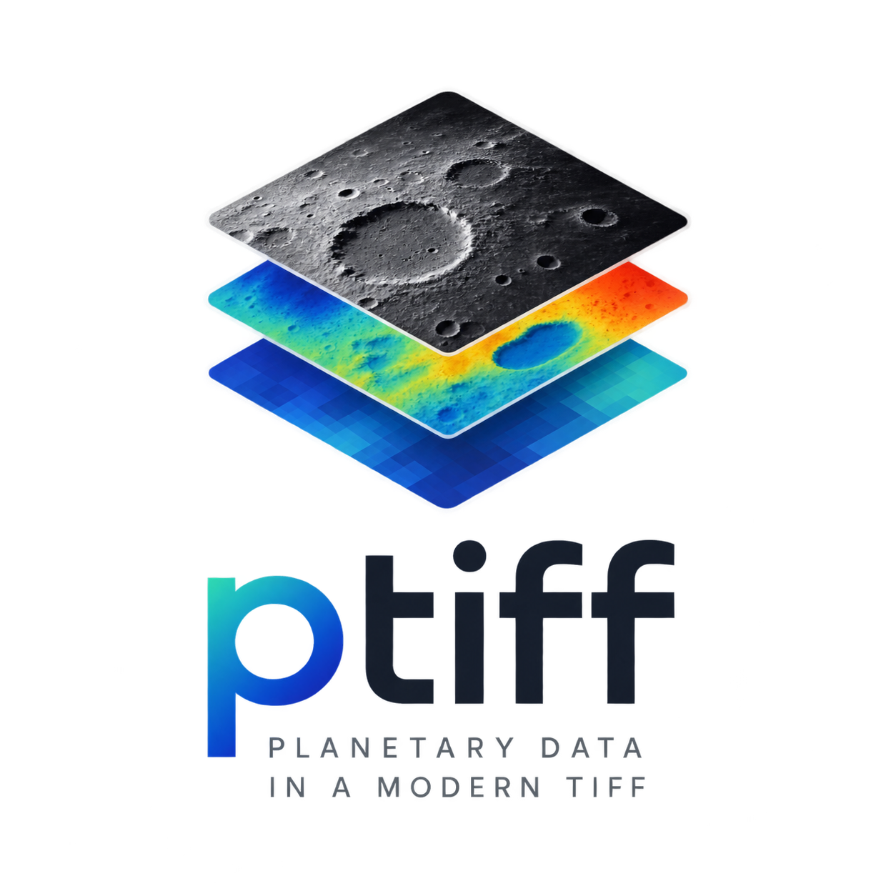

<div align="center">
  

# PTIFF

Planetary TIFF

An open TIFF-compatible scientific image standard for planetary imagery,
stereo vision, GIS, AI and 3D reconstruction.

</div>

**Status: `1.1.0`** — die Referenzimplementierung ist eine reine Rust-Workspace
(`ptiff-core` → `ptiff-rust` → `ptiff-cli` / `ptiff-c`). Sie liest und schreibt
TIFF/BigTIFF inklusive Kompression und Mehrbild-Dokumente, bietet mehrere
weitere echte Backends und einen Lese-Transport für Cloud-Object-Storage. Der
Teil der PTIFF-2.x-Welt (die frühere C++-Veneer `libptiff_c` und die C++
`libptiff`-Bibliothek) ist vollständig durch Rust ersetzt und gelöscht.
Neu in 1.0.0: `samplesPerPixel` unterstützt nun beliebige Bandzahlen (1–512,
nicht mehr nur Grau/RGB) für multispektrale Daten, inkl. korrektem
`ExtraSamples`-Tag. Die PTIFF-spezifischen Private-Tags **65001–65005** (SPICE,
Kamera-Geometrie, CRS, Scientific-Layer, Provenienz) sind als konkreter
TIFF-Tag-Output implementiert und roundtrip-fest getestet.
Neu in 1.1.0: eine native **Julia-Bindung** `Ptiff.jl` (`bindings/julia`), die
`libptiff_c` über `ccall` direkt anspricht — Teil der Benchmark-Suite
(`bench_julia.jl`) und der CI (`julia-bindings.yml`).

## Features (Stand 1.1.0)

- **TIFF/BigTIFF lesen und schreiben** (`TiffBackend` im Rust-Kern): Header/IFD-Parsing,
  Tile-/Strip-Lesen, Mehrbild-Dokumente (IFD-Kette), format-neutrales
  `ImageSink`/`ImageSource`-Tile-Modell.
- **PTIFF Private-Tags 65001–65005** (`RFC-7002`): versionierter Payload-Codec
  für SPICE/Kamera/CRS/Scientific-Layer/Provenienz; `ptiff.<domäne>.*`-Felder am
  `StorageModel` werden in die IFD geschrieben und beim Lesen zurückgewonnen.
- **Kompression**: LZW, PackBits, Deflate und JPEG, jeweils mit
  `Predictor = 2`-Unterstützung wo zutreffend.
- **Weitere echte Backends**: PDS4, ISIS3 CUB, Zarr, OpenEXR und ein
  In-Memory-Backend ("PMEM") — alle als echte Formate, nicht als Stubs.
- **Cloud-Object-Storage (lesend)**: `HttpRangeBinaryReader` liest ein
  Cloud-Optimized TIFF/BigTIFF über HTTP(S) `Range`-Requests;
  der Reader wählt per `http://`/`https://` automatisch den Transport.
- **Robustheit**: Parser-Härtung gegen missgebildete Dateien (RFC-0001 §13),
  Overflow-geschützte Arithmetik und Allokations-Guards.
- **Reine Rust-Implementierung**: kein C++, kein C-ABI im Kern
  (`#![forbid(unsafe_code)]`); die stabile C-ABI lebt in einem
  separaten `ptiff-c`-Crate, damit C/C++ und FFI-Runtimes (Go, Python,
  Ruby, Octave, Julia) `libptiff_c` gegen den Rust-Kern linken können.
- **Anbindung**: `libptiff_c` (sprachunabhängige "extern C"-Veneer über den
  Rust-Kern) als Grundlage für die Go-/Python-/Ruby-/Octave-/Julia-Bindings
  und die Rust-CLI `ptiff`. Darauf baut ein **MCP-Server**
  ([`bindings/mcp`](./bindings/mcp)) auf, der PTIFF als LLM-Werkzeuge
  (Model Context Protocol) über stdio bereitstellt — z. B. für Claude Code.

Architektur und Design-Rationale: `ARCHITECTURE.md`, `RUST-WORKSPACE.md`
und `CHANGELOG.md`. Die Rust-Beispiele liegen in `crates/ptiff-rust/examples/`
(siehe `examples/README.md`).

## Build & Test

Rust-Toolchain (stable, MSRV 1.97) + Cargo. Der Kern ist dependency-arm und
baut eigenständig; `cargo` ist der reale Build, CMake/CPack ist nur noch ein
dünner Packaging-Wrapper (siehe `CMakeLists.txt`).

```bash
# Workspace vollständig bauen (alle Crates, alle Features)
cargo build --workspace --all-features

# Alle Tests (Unit + Integration + Examples)
cargo test --workspace --all-features

# Lint & Format
cargo fmt --all -- --check
cargo clippy --workspace --all-features -- -D warnings
```

Die stabile C-ABI-Header (`target/ptiff_c.h`) wird von `cbindgen` zur
Build-Zeit aus `crates/ptiff-c` erzeugt und an `CARGO_TARGET_DIR` (bzw.
`target/`) geschrieben. Den C-ABI-Akzeptanztest ausführen:

```bash
make -C crates/ptiff-c/tests/c test         # erwartet "ALL OK"
```

Einzelexamples:

```bash
cargo run -p ptiff --example write_local_sample -- ./sample.tif
cargo run -p ptiff --example read_local_sample  -- ./sample.tif
```

## License

PTIFF is **free to use**: the specification (`LICENSE-SPEC`) and the
reference implementation (the Rust workspace, `LICENSE`) are both released
under the [Apache License, Version 2.0](https://www.apache.org/licenses/LICENSE-2.0).
You may use, modify, extend, and redistribute them, including in commercial
and closed-source products. See [`LICENSE`](LICENSE) and
[`LICENSE-SPEC`](LICENSE-SPEC) for the full terms.

## Documentation

Der Einstieg in die Software-Dokumentation ist [`docs/README.md`](docs/README.md):
Überblick, Werkzeug-Anforderungen, CI-Verhalten und die vollständigen
Generierungs-Anweisungen für beide Dokumentations-Sets.

- **Rust-API (primär):** `cargo doc --workspace --all-features --no-deps --lib`
  (Ausgabe: `target/doc/`; Notizen: `docs/rustdoc/`)
- **C-ABI + C++-Binding + Konzeptseiten:** `mkdir -p build/docs && doxygen
Doxyfile` aus dem Repo-Root, alternativ `cmake --build build --target docs`
  (Ausgabe: `build/docs/html`); die handgeschriebenen Doxygen-Seiten liegen
  unter `docs/doxygen/`.

Generierte Ausgaben (`build/docs/`, `target/doc/`) werden nie eingecheckt.
